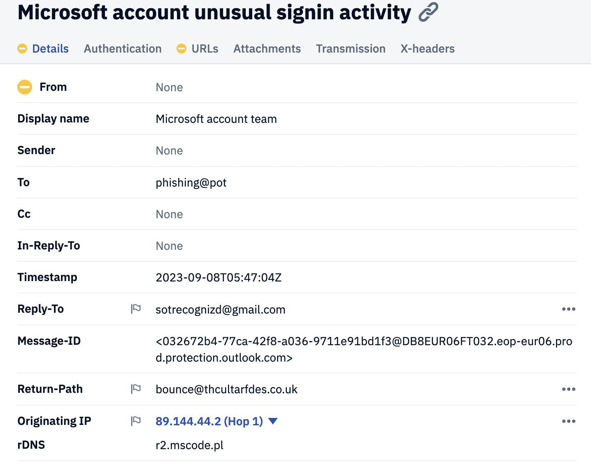
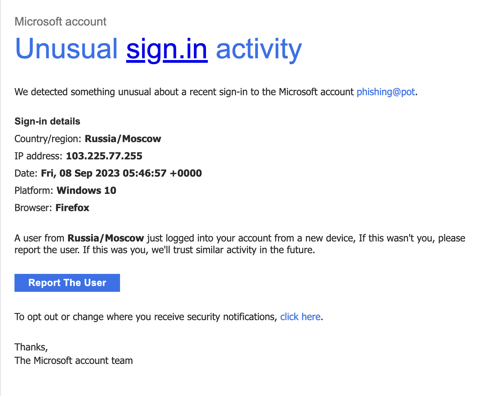
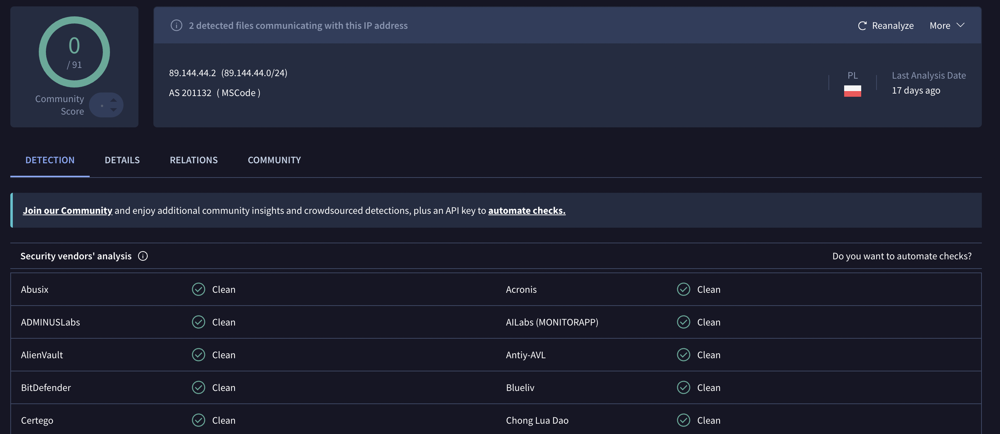

# Case 001 — Microsoft Account Impersonation
**Date analysed:** June 2026  
**Analyst:** Dominika Bobkiewicz  
**Sample source:** rf-peixoto/phishing_pot (GitHub)  
**Verdict:** MALICIOUS — High Confidence

---

## Summary

A phishing email impersonating the Microsoft account 
security team, designed to trick victims into 
interacting via email rather than clicking a 
malicious link. Uses urgency and fear to manipulate 
victims into confirming their email address is active.

---

## Email Header Analysis

| Field | Value | Finding |
|---|---|---|
| Display Name | Microsoft account team | Impersonating Microsoft |
| Sender | None verified | No legitimate sender confirmed |
| From domain | access-accsecurity.com | Fake lookalike domain — not microsoft.com |
| Reply-To | sotrecognizd@gmail.com | Attacker's Gmail inbox — flagged by PhishTool |
| Return-Path | bounce@thcultarfdes.co.uk | Unrelated UK domain used to send email |
| Originating IP | 89.144.44.2 | Polish server — not Microsoft infrastructure |
| rDNS | r2.mscode.pl | Polish domain — confirms non-Microsoft origin |

---

## Authentication Results

| Check | Result | Meaning |
|---|---|---|
| SPF | None | No SPF record configured |
| DKIM | Not verified | No valid signature present |
| DMARC | Fail | Email did not pass authentication |

**What this means:** A legitimate Microsoft email 
would pass all three checks. Failing all three 
strongly indicates spoofing or unauthorised sending.

---

## Key Concepts Learned During This Investigation

### What is SPF?
SPF (Sender Policy Framework) is like a guest list 
for email servers. The domain owner publishes which 
servers are allowed to send email on their behalf. 
If an email comes from a server not on that list — 
SPF fails. Here, thcultarfdes.co.uk had no SPF 
record at all — meaning it was set up purely to 
send phishing emails, not for legitimate use.

### What is DKIM?
DKIM (DomainKeys Identified Mail) is like a wax 
seal on a letter. It adds a digital signature 
verifying the email came from who it claims and 
was not tampered with in transit. No valid DKIM 
here confirms the email is not genuinely from 
Microsoft.

### What is DMARC?
DMARC combines SPF and DKIM results and tells 
receiving servers what to do when both fail. 
A DMARC fail means the email did not meet the 
domain's own security requirements.

### What is rDNS?
Reverse DNS (rDNS) does the opposite of normal DNS. 
Normal DNS translates names to IP addresses. 
rDNS translates IP addresses back to domain names. 
The IP 89.144.44.2 resolves to r2.mscode.pl — 
a Polish server with no connection to Microsoft, 
confirming the email originated from attacker 
infrastructure.

### What is email harvesting?
Instead of directing victims to a fake login page, 
this attack uses mailto links that open the 
victim's email client. When a victim clicks either 
button, it confirms their email address is active 
and that they interacted with the email. The 
attacker can then follow up directly, build trust, 
and attempt to steal credentials over email. 
This technique is harder for automated tools to 
detect because there are no malicious URLs to scan.

### Why does VirusTotal showing Clean not mean Safe?
Attackers constantly register fresh domains and 
rotate IP addresses specifically to avoid detection 
tools. A brand new domain registered for a phishing 
campaign will show clean on every tool because 
nobody has reported it yet. Context and correlation 
across all findings matters more than any single 
tool result.

---

## Indicators of Compromise (IOCs)

| Type | Value | Significance |
|---|---|---|
| Fake domain | access-accsecurity.com | Microsoft impersonation domain |
| Attacker email | sotrecognizd@gmail.com | Appears in Reply-To and both mailto buttons |
| Sending domain | thcultarfdes.co.uk | Infrastructure used to send phishing email |
| Sender IP | 89.144.44.2 | Polish server, unrelated to Microsoft |
| rDNS | r2.mscode.pl | Confirms Polish origin |

---

## Attack Technique Analysis

**Technique:** Microsoft impersonation via email harvesting

**Tactic:** Social engineering using urgency and 
fear — unusual signin activity creates panic and 
bypasses rational thinking

**Two malicious buttons identified in email body:**

**Button 1 — Report The User**

| Field | Value |
|---|---|
| Link type | mailto |
| Destination | sotrecognizd@gmail.com |
| CC | sotrecognizd@gmail.com |
| Subject | unusual signin activity |
| Purpose | Confirms victim email address is active |

Pretends to let victim report suspicious activity. 
Actually sends an email to the attacker confirming 
the victim interacted with the phishing email.

**Button 2 — Unsubscribe**

| Field | Value |
|---|---|
| Link type | mailto |
| Destination | sotrecognizd@gmail.com |
| CC | sotrecognizd@gmail.com |
| Subject | Unsubscribe me |
| Purpose | Confirms victim email address is active |

Pretends to let victim opt out of security emails. 
Has the same effect as Button 1 — confirms an 
active email address to the attacker.

**Why no malicious URL?**

This email deliberately avoids website links to 
evade URL scanning tools. This is more sophisticated 
than typical credential harvesting phishing because 
automated scanners have nothing to flag.

---

## VirusTotal Results

| IOC | Result | Notes |
|---|---|---|
| 89.144.44.2 | 0/91 Clean | IP not yet reported — common for fresh phishing infrastructure |
| thcultarfdes.co.uk | Clean | Domain too new to be flagged by vendors |

---

## Verdict

| Field | Detail |
|---|---|
| Classification | Malicious — Phishing |
| Confidence | High |
| Attack type | Microsoft impersonation via email harvesting |
| Recommended action | Block sending domain, block Return-Path domain, report attacker Gmail to Google, warn users not to interact |

---

## Screenshots

### PhishTool Analysis Panel

### Decoded Email — What the Victim Sees

### VirusTotal IP Check

---

*Sample source: github.com/rf-peixoto/phishing_pot*  
*Tools used: PhishTool, MXToolbox, VirusTotal*
